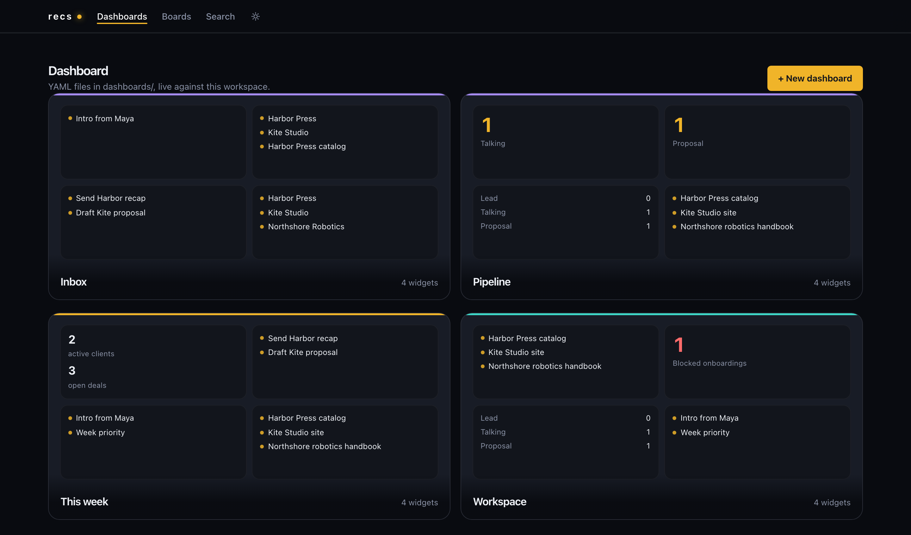
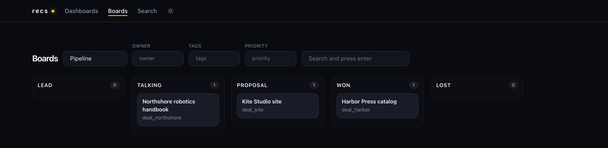

<!-- Documents: STK-REQ-260820-KAGT STK-REQ-260820-V5ZD STK-REQ-260820-Y3Q4 STK-REQ-260820-T8AZ STK-REQ-260820-4255 STK-REQ-260821-QTPP STK-REQ-260821-NTWY SYS-REQ-260820-456X SYS-REQ-260821-8FKR -->

[](https://github.com/buger/recs/actions/workflows/ci.yml) [](https://github.com/buger/recs)  [](proof.yaml)

# recs

**The CRM your agents actually run. Local files. Unlimited dashboards.**

An agent needs a place to keep people, companies, deals, notes, and next actions, then a way to *see* that work. Hosted agent dashboards meter the views: 10 widgets on one plan, 25 on another, 20 projects until you pay up. recs is the opposite. The CRM is Markdown on disk. The CLI is how the agent reads and writes it. Dashboards and boards are YAML views over those files, as many as you want, on as many topics as you have.

One workspace for clients. Another for hiring. Another for a research beat. No account. No credit pool. No widget cap.

> **TL;DR** — `recs` is a file-native CRM for agents. Records are Markdown. The agent uses a deterministic CLI (`--help`, `--json`). You (or the agent) write unlimited YAML dashboards and boards on top. The local UI is a projection, not the database.



## Why

I wanted what the agent-dashboard products tease, without the ceiling. Unlimited dashboards. A CRM that lives next to the repo, not in someone else's project quota. Agents that can work a pipeline on Monday and a hiring board on Tuesday without asking a membership plan for another slot.

So the system of record is files. Intelligence stays in the agent you already run. recs never ships a model, a login, or a cloud sync. It ships the store, the query, the board, the dashboard, and a localhost UI.

## Install

```
go install github.com/buger/recs/cmd/recs@latest
recs serve --root testdata/sample
```

Open [http://localhost:7777](http://localhost:7777). Light and dark from a toggle in the UI. From source: `go build -o recs ./cmd/recs`.

## 60 seconds

```
recs init
recs create person --id person_maya --name "Maya Chen"
recs create deal --title "Harbor Press catalog" --set status=talking
recs query 'type=deal status=talking' --json
recs board pipeline
recs dashboard
recs serve
```

The agent learns the rest from `recs --help`. No skill file. No SDK.

## What the agent gets

A workspace is a folder. Records are Markdown with YAML frontmatter. State lives in the fields, not in the directory name.

```markdown
---
id: deal_harbor
type: deal
title: Harbor Press catalog
status: talking
owner: demo
---

Talked with [[Maya Chen]] about the catalog refresh.
```

Boards are matcher views. Drag a card, `on_drop` writes frontmatter. Same engine as `recs move`.



```yaml
name: Pipeline
match:
  type: deal
column:
  field: status
columns:
  - id: talking
    title: Talking
  - id: proposal
    title: Proposal
    on_drop:
      set:
        status: proposal
        proposed_at: $now
```

Dashboards are YAML too. Each widget is a query, not a copy of the data. Add another file, get another dashboard. There is no plan limit.

```yaml
id: week
name: This week
layout: 2x2
widgets:
  - id: pulse
    type: metrics
    title: Pipeline
    query: 'type=deal'
  - id: next
    type: list
    title: Open tasks
    query: 'type=task status=open'
```

Two starting workspaces:

- [testdata/sample](testdata/sample) — a small fictional client CRM (the screenshots)
- [examples/studio](examples/studio) — a fuller studio practice: retainers, hiring, the week

Copy either. Or `recs init` and have the agent grow a workspace per topic.

## CLI

| | |
|---|---|
| records | `init` `create` `show` `list` `set` `patch` `edit` `delete` `link` |
| find | `search` `query` `context` `inbox` |
| views | `board` `dashboard` `move` `next` `triage` |
| exchange | `ingest` `export` `import` |
| git | `diff` `changed` `history` |
| serve | `serve` |
| hygiene | `validate` `index` |

`recs help <cmd>` prints usage, flags, examples, and the JSON shape. Failed writes return `ok: false` plus `error`, field, and allowed values.

```
recs triage --json
recs context customer_harbor --md
recs query 'type=deal status=proposal' --json
```

## Specs

In-repo [ReqProof](https://reqproof.com), assurance target L3, `evidence_strict` on. A full `proof audit --fail-level warn` on 2026-08-21 is 0 errors, 0 warnings. Live objects: [`specs/`](specs/), [`proof.yaml`](proof.yaml). See [CONTRIBUTING.md](CONTRIBUTING.md).

## Contributing

The source is open. Development is on us. Issues for bugs, ideas, and design notes. We do not accept unsolicited pull requests.

## License

[MIT](LICENSE). Copyright 2026 Leonid Bugaev.

The workspace marker is still `crm.yaml`. Cache lives in `.crm/`. Git is optional.
