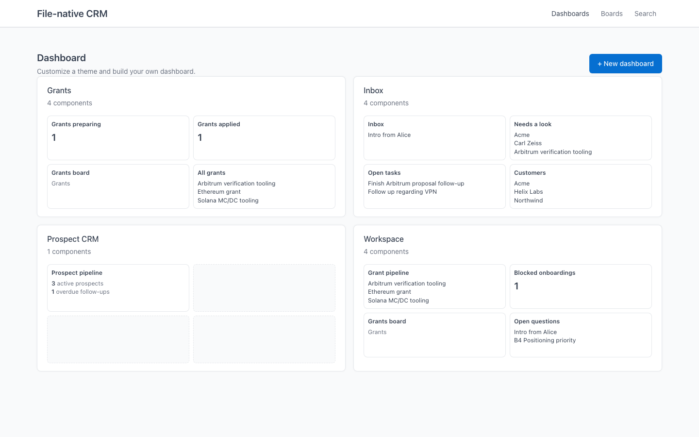
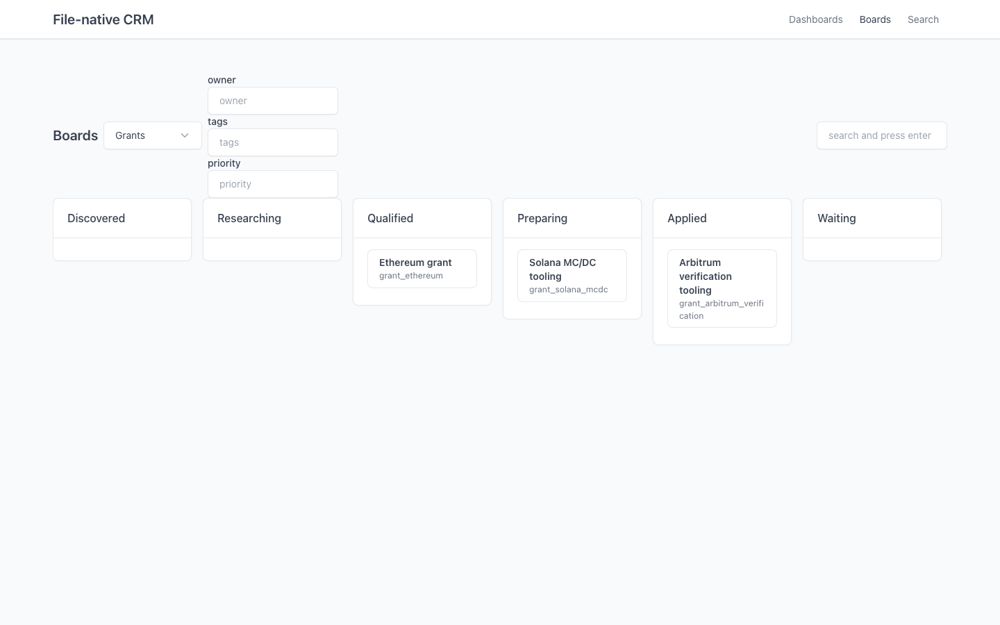

<!-- Documents: STK-REQ-260820-KAGT STK-REQ-260820-V5ZD STK-REQ-260820-Y3Q4 STK-REQ-260820-T8AZ STK-REQ-260820-4255 STK-REQ-260821-QTPP STK-REQ-260821-NTWY SYS-REQ-260820-456X SYS-REQ-260821-8FKR -->

[](https://github.com/buger/recs/actions/workflows/ci.yml) [](https://github.com/buger/recs)  [](proof.yaml)

# recs

**File-native records** you can query, board, and serve — without a SaaS.



```
Files are the database.
The CLI is deterministic.
Agents supply intelligence.
The local UI is a projection.
```

Not Salesforce. Not Notion. Not another markdown kanban. It's Git + Markdown + query + boards, with a small local UI. CRM is one shape it takes.

## Specs

recs is specified in-repo with [ReqProof](https://reqproof.com), the same tool as [jsonparser](https://github.com/buger/jsonparser). That is the method. It is not a finished verification story.

There are 64 requirement files today (62 approved, 2 retired with Cosmopolitan). That is a small spec for a CLI, boards, dashboards, and a local UI. This page does not claim L3 assurance, a 0/0 audit, or complete MC/DC. Those numbers go here after we earn them. The live objects are [`specs/`](specs/) and [`proof.yaml`](proof.yaml).

What is true now: public behavior is supposed to live in requirements, changes go through proof changes, and agents learn the CLI from `recs --help` and `--json`. See [CONTRIBUTING.md](CONTRIBUTING.md).

## Install

Twenty seconds:

```
go install github.com/buger/recs/cmd/recs@latest
recs serve --root testdata/sample
```

From source: `go build -o recs ./cmd/recs`. Open [http://localhost:7777](http://localhost:7777). Tabler CSS, vanilla JS, no React. Home is the dashboard gallery; boards sit under `#/boards`.

## Records, boards, dashboards

A record is Markdown with YAML frontmatter. State lives in the fields, not the folder.

```markdown
---
id: grant_solana_mcdc
type: grant
title: Solana MC/DC tooling
status: preparing
tags: [solana, rust]
deadline: 2026-09-20
---

# Solana MC/DC tooling

Talked with [[Alice Smith]] about [[Acme]] onboarding.
```

A board is a matcher view. Drop a card and `on_drop` writes frontmatter — same engine as `recs move`.



Kanban over markdown records: columns are field values, not folders.

```yaml
name: Grants
match:
  type: [grant, application]
column:
  field: status
columns:
  - id: preparing
    title: Preparing
  - id: applied
    title: Applied
    on_drop:
      set:
        status: applied
        applied_at: $now
```

A dashboard is YAML too. Widgets are queries, not copies of data.

```yaml
id: workspace
name: Workspace
layout: 2x2
widgets:
  - id: grants
    type: list
    title: Grant pipeline
    query: 'type=grant'
    group_by: status
  - id: blocked
    type: count
    title: Blocked onboardings
    query: 'type=onboarding status=blocked'
  - id: board
    type: board
    board: grants
  - id: notes
    type: notes
    query: 'type=note'
```

That's a file-native workspace: markdown records on disk, yaml dashboards as views.

## CLI

| | |
|---|---|
| records | `init` `create` `show` `list` `set` `patch` `edit` `delete` `link` |
| find | `search` `query` `context` `inbox` |
| views | `board` `dashboard` `move` `next` `triage` |
| exchange | `ingest` `export` `import` |
| git | `diff` `changed` `history` |
| serve | `serve` |
| hygiene | `validate` `index` |

`recs help <cmd>` prints usage, flags, examples, and the JSON shape.

## Agents

Agents don't get skill files. No `AGENTS.md`, no `SKILL.md`, no `recs agent install`. Help is the prompt. `--json` is the contract.

```
recs --help
recs help query
recs triage --json
recs context customer_acme --md
recs query 'type=grant status=preparing' --json
```

Failed mutations return structured errors (`ok: false`, `error`, field, allowed), not a stack dump.

## Out

Permanent. Not later work.

- Gmail / IMAP / Outlook inside the binary
- cloud sync, login, multi-user permissions
- an in-app model, embeddings, or vector store
- skill files or an agent SDK
- plugins, SQLite fallback, hosted deploy
- Cosmopolitan / APE packaging

If it needs judgment, a network account, or a third-party API, an agent does it against the files or the CLI.

## Contributing

The source is open. Development is on us.

Open a GitHub issue for a bug, an idea, or a design note. We do not accept unsolicited pull requests. [CONTRIBUTING.md](CONTRIBUTING.md) is the policy.

## License

[MIT](LICENSE). Copyright 2026 Leonid Bugaev.

The workspace marker is still `crm.yaml`. Cache lives in `.crm/`. Git is optional.

See [docs/phase1.md](docs/phase1.md), [docs/dashboards.md](docs/dashboards.md), [docs/product-notes.md](docs/product-notes.md), and [proof.yaml](proof.yaml).
